# Inventra — Inventory Management System

A production-minded inventory management system built with **Go, PostgreSQL, React, and TypeScript** — featuring multi-warehouse inventory, reservations, cycle counts, RBAC, audit trails, and transactional stock operations.

> **Security warning:** seeded default admin is `Admin123!`. Change it immediately after first login (`POST /api/v1/auth/change-password`). Never ship it in production.

| Dashboard | Inventory |
|---|---|
|  |  |

<details>
<summary><b>View all 18 screenshots</b> — dashboard, products, categories, inventory, transactions, reports, users, activity, settings, responsive</summary>

| Dashboard | Inventory | Transactions |
|---|---|---|
|  |  |  |
| 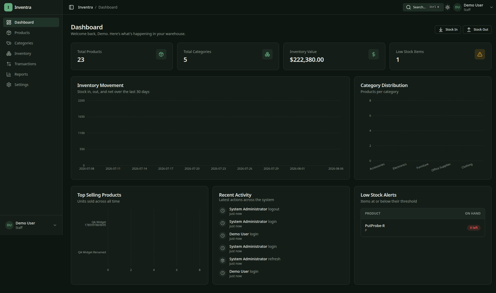 | 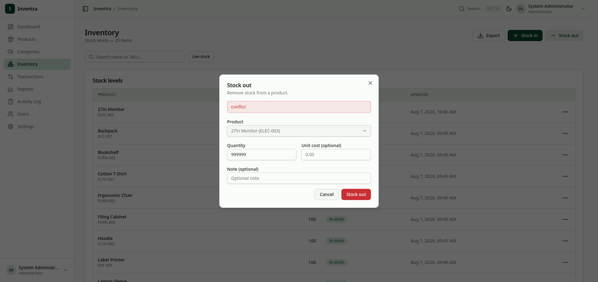 | 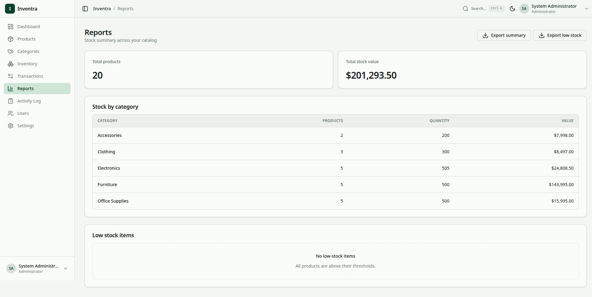 |
| 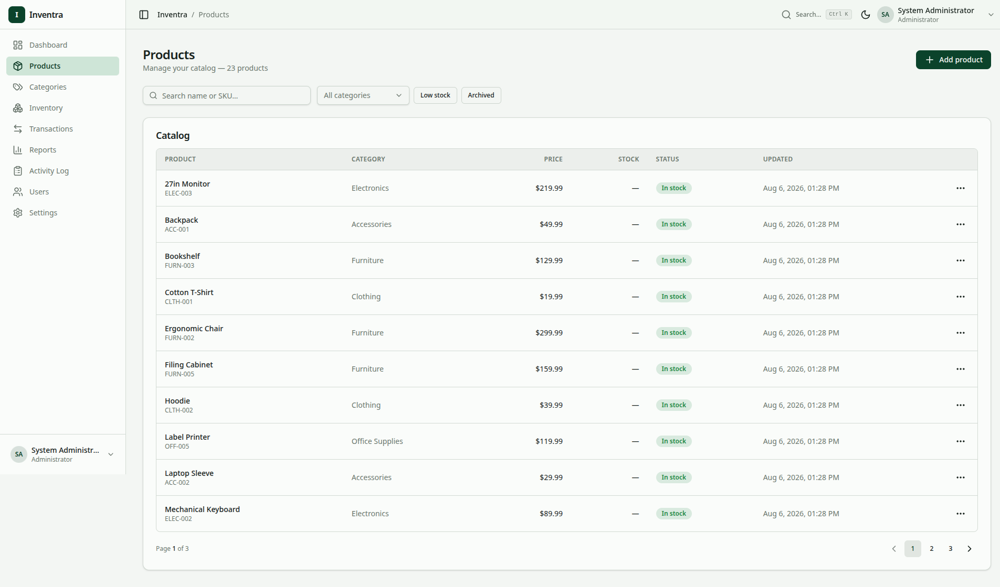 | 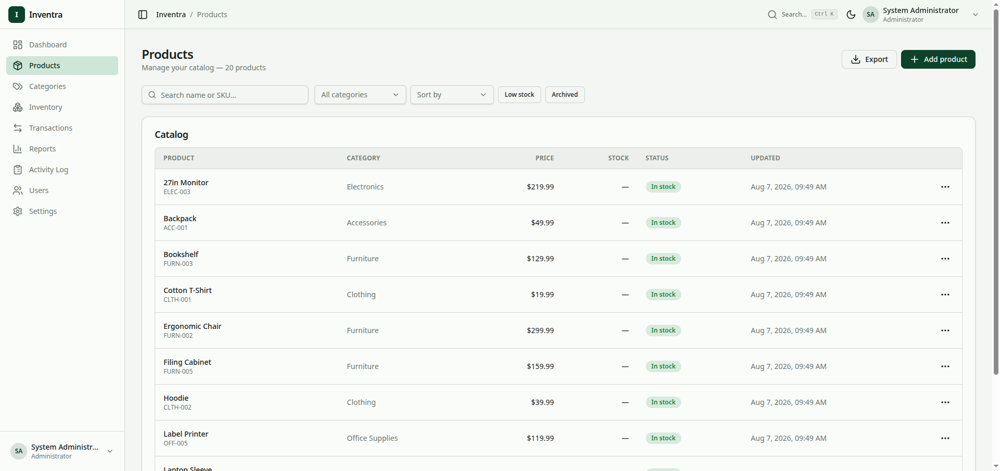 | 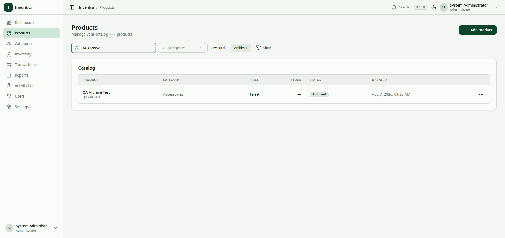 |
| 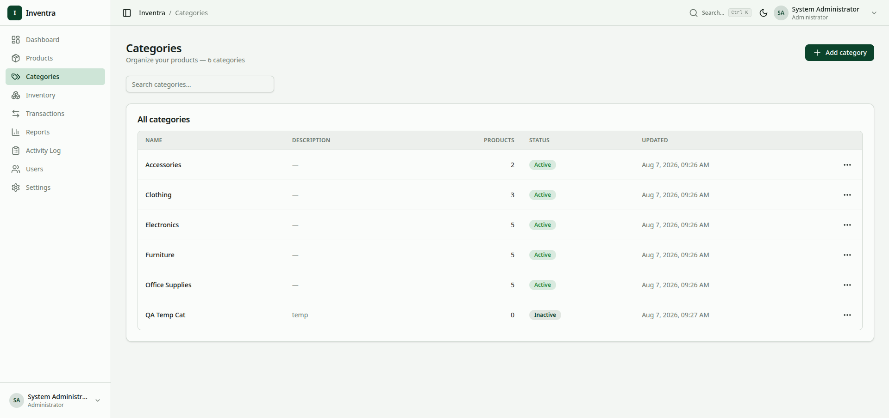 | 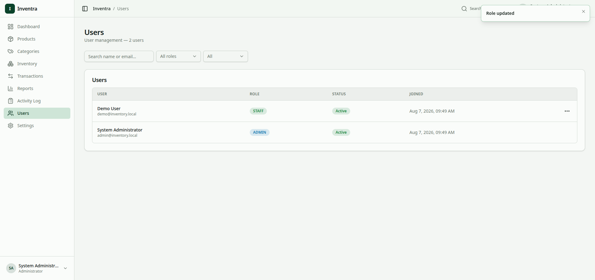 |  |
| 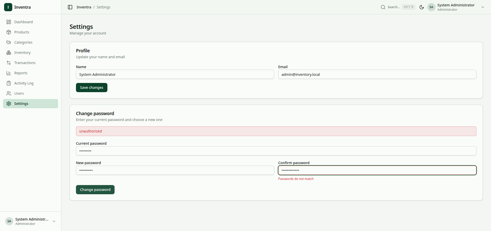 | 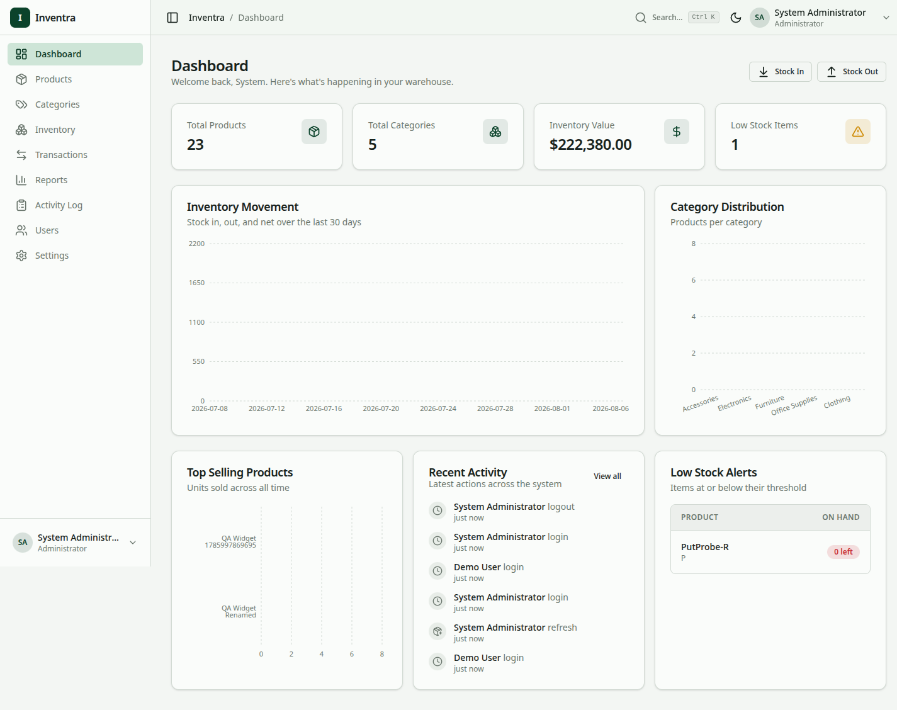 | 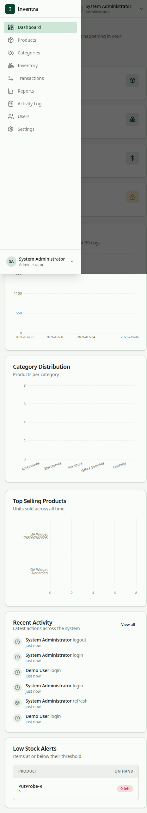 |
| 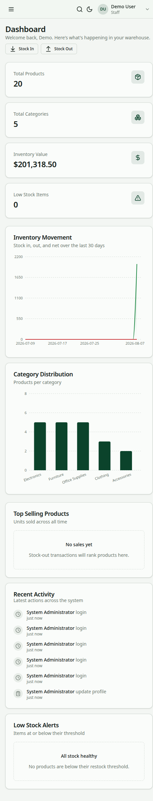 | 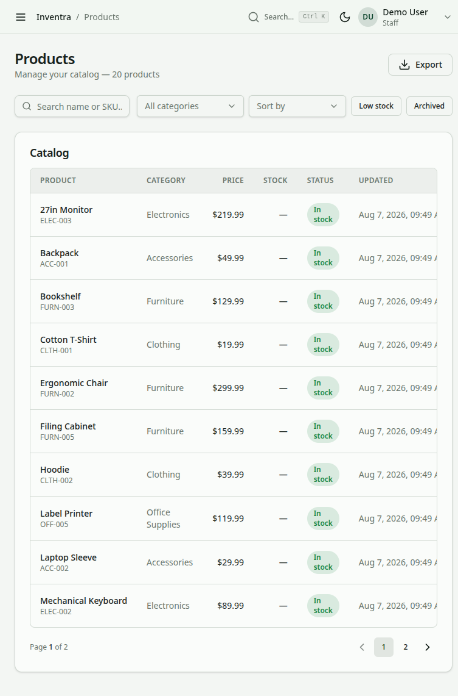 | 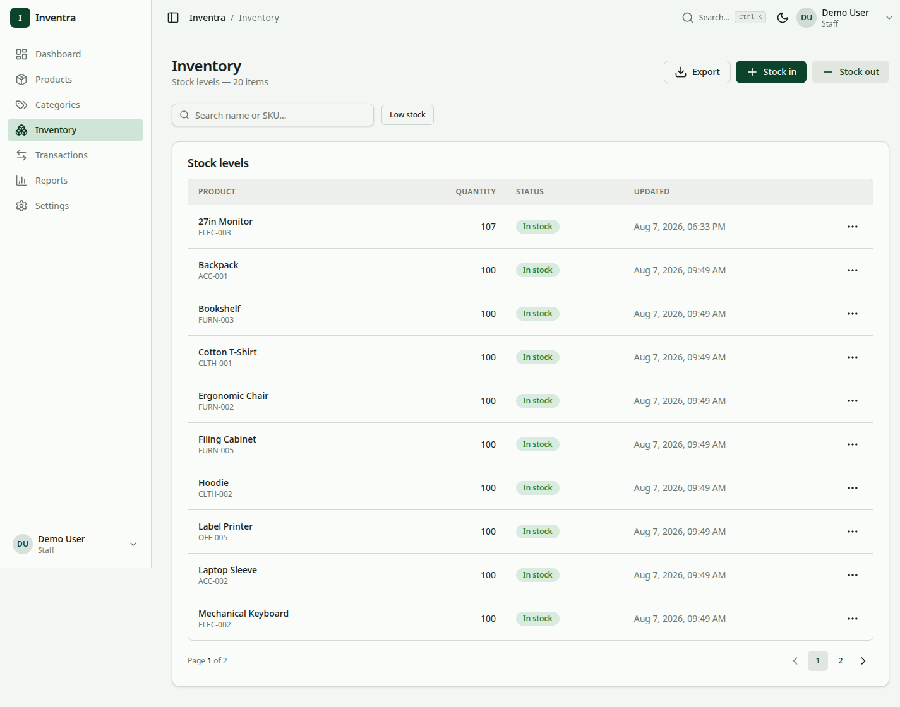 |

</details>

---

## Table of contents

- [Key Features](#key-features)
- [Tech Stack](#tech-stack)
- [System Architecture](#system-architecture)
- [Engineering Highlights](#engineering-highlights)
- [Data Integrity](#data-integrity)
- [Data Model](#data-model)
- [API Overview](#api-overview)
- [Roles & Permissions](#roles--permissions)
- [Getting Started](#getting-started)
- [Configuration](#configuration)
- [Testing](#testing)
- [Make Targets](#make-targets)
- [Security](#security)
- [Documentation](#documentation)
- [License](#license)

---

## Key Features

- **Multi-warehouse inventory** — same SKU tracked per warehouse with a composite unique key
- **Stock operations** — receive, issue, and warehouse-to-warehouse transfers
- **Reservations** — available stock = on-hand − reserved, with lazy expiry
- **Cycle counts & adjustments** — variance detection and manager approval workflow
- **Append-only ledger** — every movement is an immutable row; balances are derived
- **RBAC** — database-backed roles and permissions enforced by middleware
- **Audit trail** — who did what, when, and from where for every mutation
- **Dashboard & reports** — aggregates, low-stock alerts, and CSV exports

---

## Tech Stack

### Backend

| Concern | Technology |
|---|---|
| Language | Go 1.24 |
| HTTP | Gin 1.11 + GORM 1.31 (pgx) |
| Database | PostgreSQL 17 |
| Migrations | golang-migrate 4.19 |
| Auth | golang-jwt/v5 (HS256) + bcrypt cost 12 |
| Config / Logs | Viper + Zap |
| Validation / Docs | validator/v10 + swaggo |
| Testing | testify + uber mock |

Details: `docs/stack-versions.md`

### Frontend (`web/`)

| Concern | Technology |
|---|---|
| UI | React 19 + TypeScript 5.7 + Vite 6 + Tailwind 4 |
| Primitives | Radix UI (shadcn-style kit) |
| State / Data | TanStack Query 5 + React Router 7 + react-hook-form + Zod |
| Charts | Recharts |

### Infrastructure

Docker multi-stage build + Compose (healthchecked) · GitHub Actions (build/test/lint + govulncheck)

---

## System Architecture

```
React SPA (Vite · TanStack Query · Tailwind)
        ↓ JSON
Go / Gin API (/api/v1 · /healthz · /swagger)
        ↓
Router → Handler → Service → Repository (GORM)
        ↓
PostgreSQL 17 (golang-migrate 000001…000013)
```

Backend uses a **vertical-slice** layout — each module (`auth`, `product`, `category`, `warehouses`, `inventory`, `adjustment`, `cyclecount`, `dashboard`, `report`, `activitylog`) owns its `router`, `handler`, `service`, `repository`, `model`, and tests. Dependencies point one way: `handler → service → repository`. Cross-cutting concerns (`audit`, `config`, `database`, `dbutil`, `errors`, `export`, `logger`, `middleware`, `response`, `validator`) live in `internal/shared/` and are injected downward.

> Deep dive: `docs/architecture.md` · `docs/backend.md`

---

## Engineering Highlights

**Transactional operations.** Every multi-table stock mutation is atomic — receive, issue, transfer (two ledger rows sharing one `transfer_id`), reservation lifecycle, corrections, and cycle count plan creation. Idempotency keys (`Idempotency-Key` header, 24h TTL) make retried writes safe.

**Concurrency control.** PostgreSQL row-level locks (`FOR UPDATE`) are held inside the transaction on every hot path. The `inventory` row is locked, stale reservations are lazily expired, and `available = quantity − active reservations` is checked before any decrement. A `version` column is bumped on every movement for optimistic detection.

**Inventory ledger.** Movements are append-only — corrections create a new `ADJUSTMENT` row, never an edit. The running balance is computed on read with a window function, so it can never drift from its history.

**Idempotency.** Required because duplicate stock requests would double-apply. Same key + same body replays the stored `2xx`; same key + different body is rejected with `409`.

**RBAC.** Roles and permissions are database-backed (migrations `000005`/`000008`) and enforced by middleware, not scattered `if role ==` checks.

**Auditability.** Every mutation records who, what, and context (IP, user agent, request ID, before/after data) via a failure-safe recorder that never fails the business operation.

---

## Data Integrity

Inventra protects integrity at four layers. Details belong in `docs/database.md` — the README explains *why*, not every constraint.

**Application validation.** All request DTOs are validated with `validator/v10` through a shared wrapper (`internal/shared/validator`). Structural tags (`required`, `min`, `email`, `oneof`) reject bad input at the HTTP boundary.

**Business rules.** Services enforce domain invariants: quantity limits, stock availability (`on-hand − reserved`), reservation state machine (`ACTIVE → RELEASED/CONSUMED/EXPIRED`), product/warehouse existence, and adjustment approval thresholds.

**Database constraints.** The final guarantee is in PostgreSQL: foreign keys, unique constraints (`sku`, `email`, `code`, `product_id+warehouse_id`), and check constraints (`quantity >= 0`, `quantity > 0`, `direction IN ('IN','OUT')`, `status` enums, `low_stock_threshold >= 0`). Migrations are versioned and applied with `make migrate-up`.

**Transaction & concurrency controls.** Multi-row operations run in `gorm.DB.Transaction` with `FOR UPDATE` locks. Single-row CRUD is intentionally not wrapped — no multi-table invariant to protect.

---

## Data Model

```
User ── belongs to ──> Role ── has many ──> Permission
Category <── has many ── Product ── stocked in ──> Warehouse
                                    │
                         InventoryItem (per warehouse)
                                    ├── InventoryLedger (append-only IN/OUT/TRANSFER/ADJUST)
                                    └── Reservation (reserved vs on-hand)

ActivityLog (who/what/when)    IdempotencyKey (write dedupe)
```

One `inventory` row per `(product, warehouse)`; ledger rows are immutable. Full ER: `docs/er.md` · Columns/indexes: `docs/database.md`

---

## API Overview

- **Base path:** `/api/v1` (JWT bearer, except `POST /auth/login` and `/auth/register`)
- **Health:** `GET /healthz` → `{"status":"ok"}`
- **Docs:** `GET /swagger/index.html` (regenerate with `make swagger`)
- **Contract:** `docs/api.md`

| Area | Examples |
|---|---|
| Auth | login, register, refresh, change-password (demo login when `DEMO_MODE=true`) |
| Products / Categories / Warehouses | CRUD, search/filter/sort, archive, CSV export |
| Inventory | stock-in, stock-out, transfer, ledger query |
| Reservations | create, release, consume |
| Adjustments / Cycle counts | submit, approve/reject, count & reconcile |
| Users | CRUD + role assignment (ADMIN) |
| Activity | paginated audit log (ADMIN) |
| Dashboard / Reports | aggregates, time series, CSV |

---

## Roles & Permissions

| Capability | ADMIN | STAFF |
|---|---|---|
| View all modules | ✅ | ✅ |
| Product / category / warehouse CRUD | ✅ | ✅ |
| Stock in / out / transfer | ✅ | ✅ |
| User management & roles | ✅ | ❌ |
| Audit log read | ✅ | ❌ |

Complete matrix: `docs/security.md`

---

## Getting Started

Prerequisites: **Go ≥ 1.24**, **Docker + Compose**, **Node.js ≥ 22** (frontend).

**Docker (recommended):**

```bash
cp .env.example .env        # set a strong JWT_SECRET
make docker-up              # builds api + postgres, waits for health
curl localhost:8080/healthz # -> {"status":"ok"}
make seed                   # roles + default admin
```

Port conflicts: `API_PORT=8081 DB_PORT=5434 make docker-up`. Stop: `make docker-down` (data in `inventra_pgdata`).

**Local development:**

```bash
docker run -d --name inventory-pg -p 5433:5432 \
  -e POSTGRES_USER=postgres -e POSTGRES_PASSWORD=postgres \
  -e POSTGRES_DB=inventory postgres:17-alpine

make seed && make run        # API on :8080
cd web && npm install && npm run dev  # SPA on Vite
```

---

## Configuration

Env-driven via Viper. Required: `DB_USER`, `DB_PASSWORD`, `DB_NAME`, `JWT_SECRET`. Full reference: `docs/deployment.md`.

| Variable | Default | Purpose |
|---|---|---|
| `PORT` | `8080` | API port |
| `DB_HOST` / `DB_PORT` | `db` / `5432` | Postgres |
| `DB_SSLMODE` / `DB_AUTOMIGRATE` | `disable` / `false` | TLS / auto-migrate at boot |
| `JWT_SECRET` | — | **required**, HS256 key |
| `JWT_ACCESS_TTL` / `JWT_REFRESH_TTL` | `15m` / `168h` | Token lifetimes |
| `BCRYPT_COST` | `12` | Hash cost |
| `LOG_LEVEL` / `DEMO_MODE` | `info` / `false` | Logging / demo login |

---

## Testing

- Unit tests per layer (`handler_test.go`, `service_test.go`, `repository_test.go`) with **testify** and **uber mock**
- Repository tests use a real Postgres (Docker) — skipped with `-short`
- Coverage gate in CI (≥80% per package)

```bash
make test            # go test -race -shuffle=on -count=1 ./...
make test-cover      # HTML coverage report
make coverage-gate   # enforce threshold
```

Conventions: `docs/testing.md`

---

## Make Targets

| Command | Purpose |
|---|---|
| `make build` | compile all packages |
| `make run` | run API |
| `make test` / `lint` | tests / golangci-lint |
| `make migrate-up` / `migrate-down` | apply / revert migrations |
| `make seed` / `seed-demo` | base data / demo dataset |
| `make docker-up` / `docker-down` | compose lifecycle |
| `make swagger` | regenerate `docs/swagger/` |

Full list: `Makefile` · `docs/deployment.md`

---

## Security

- **Passwords:** bcrypt cost 12 · **JWT:** HS256 short-lived access + rotating refresh families with reuse detection
- **Rate limiting:** per-IP on public auth endpoints (`internal/shared/middleware`)
- **RBAC:** DB-backed, middleware-enforced
- **Audit:** activity + ledger dual trail, failure-safe (never blocks business writes)
- **Validation:** shared `validator` + DB `CHECK`/`FK`/`UNIQUE`
- **Scanning:** `govulncheck v1.1.4` in CI (non-blocking); blocking locally: `go run golang.org/x/vuln/cmd/govulncheck@v1.1.4 ./...`

> Before any non-local deployment: rotate the seeded admin password and set a strong `JWT_SECRET`. Threat model: `docs/security.md`

---

## Documentation

| Doc | Purpose |
|---|---|
| `docs/architecture.md` | system architecture & layering |
| `docs/api.md` | authoritative API contract |
| `docs/database.md` | schema, constraints & integrity deep dive |
| `docs/er.md` | entity-relationship diagram |
| `docs/backend.md` | Go implementation standards |
| `docs/coding-standards.md` | style & contribution conventions |
| `docs/security.md` | auth / RBAC / threat model |
| `docs/stack-versions.md` | pinned toolchain versions |
| `docs/deployment.md` | Docker & CI runbook |
| `docs/testing.md` | testing conventions |
| `docs/ROADMAP.md` | planned work |

---

## License

Proprietary — internal project.
