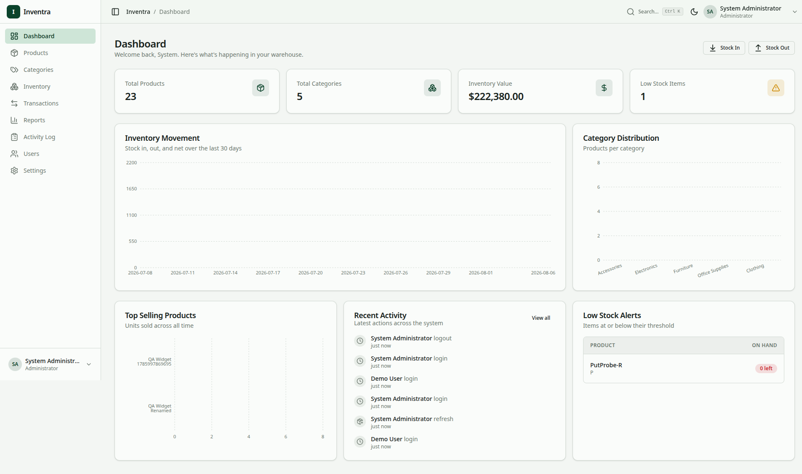
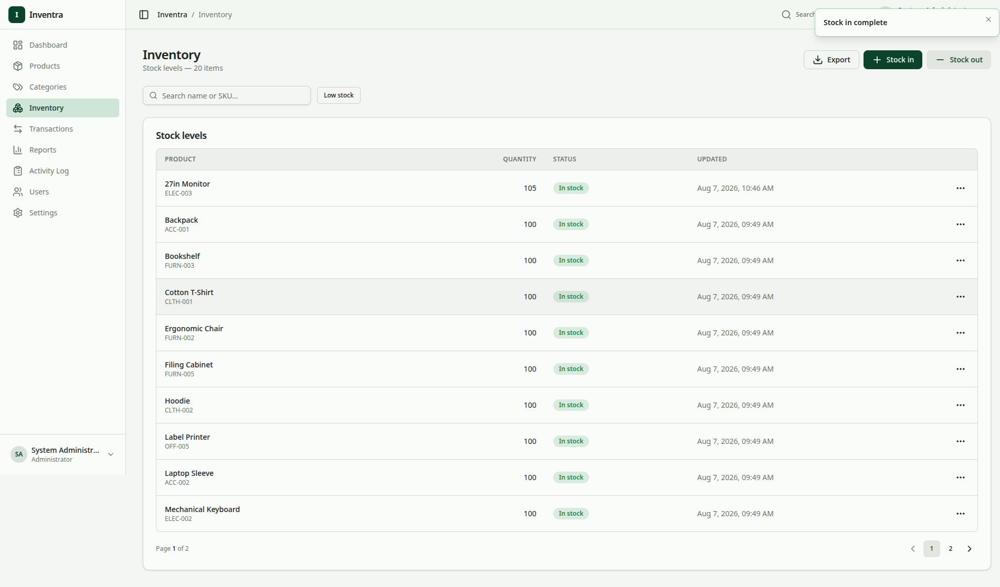
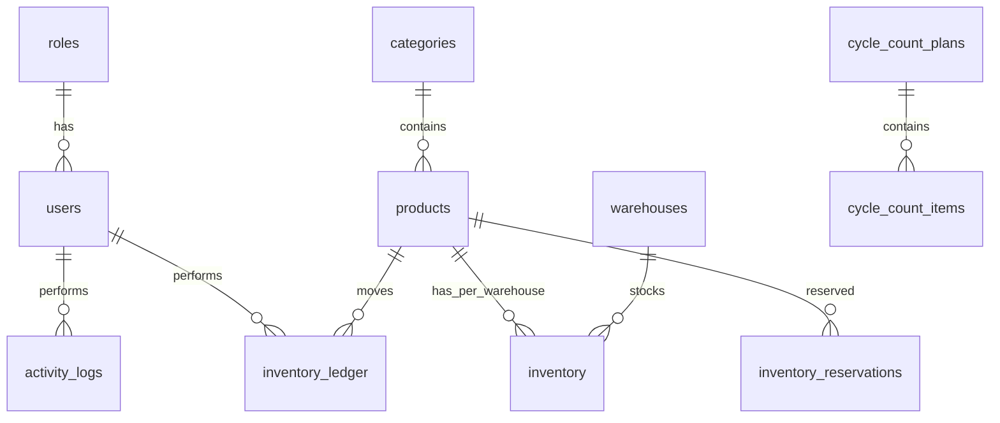
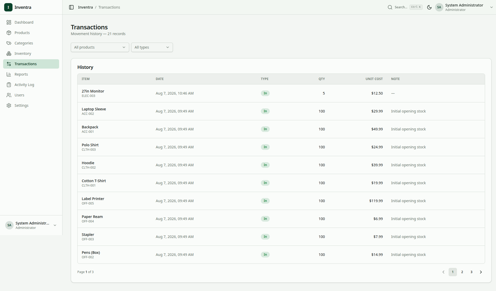
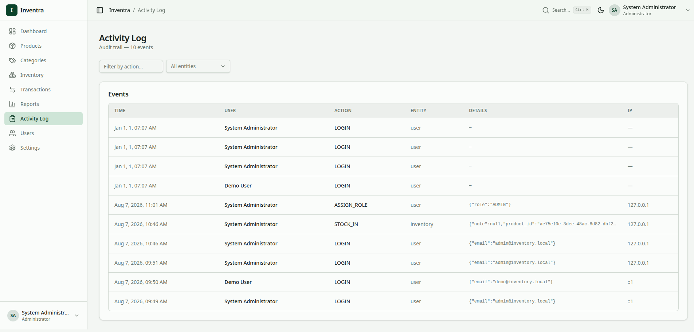

# Inventra — 3 Main Points

> **A production-ready inventory system in one page.** If you read only this file, you understand *what* Inventra does, *why* its database is safe, and *where* to verify it. For full specs, see `database.md`, `architecture.md`, and `api.md`.

**Stack:** Go 1.24 + Gin + GORM + PostgreSQL 17 + React 19 + Vite + Tailwind 4
**Status:** 13 versioned migrations (`000001…000013`), 17 live tables, Docker + CI

*Dashboard — the first screen a reviewer sees. KPIs and recent ledger activity derived from the same atomic transactions below.*

---

## Point 1 — Database Designed for Real Warehouses

### What it is
A **normalized PostgreSQL 17** schema that models a real multi-warehouse business — not a demo todo app.

**17 live tables (18 `CREATE TABLE` statements, 1 rename):**

| Group | Tables |
|---|---|
| **Core** | `roles`, `permissions`, `role_permissions`, `users`, `refresh_tokens` |
| **Catalog** | `categories`, `warehouses`, `products` |
| **Stock** | `inventory` (per `product + warehouse`), `inventory_ledger` (append-only), `inventory_reservations`, `inventory_adjustments` |
| **Counting** | `cycle_count_plans`, `cycle_count_items` |
| **Safety** | `activity_logs`, `idempotency_keys`, `system_settings` |

**13 migrations** via `golang-migrate` (`make migrate-up`). `DB_AUTOMIGRATE` is dev-only — production never drifts.

### Why it matters
Without this design, you cannot track the same SKU in 5 warehouses, you cannot reserve stock, and you cannot prove what happened.

### How it works (readable)
- **One row per product per warehouse** — `UNIQUE(product_id, warehouse_id)` (`migrations/000001:68`). Same mouse, stock 10 in `DEFAULT`, 3 in `WH-02`.
- **30+ constraints** — `CHECK quantity >= 0`, `CHECK quantity > 0`, `CHECK direction IN ('IN','OUT')`, `UNIQUE sku/email/code`, `FOREIGN KEY` everywhere. Bad data is rejected by the database, not just the app.
- **5 indexes** for the queries you actually run — `idx_inventory_product_warehouse`, `idx_ledger_product_created`, `idx_activity_created` etc. Lists and history stay fast.

*Inventory — per-warehouse stock (`UNIQUE product_id+warehouse_id`) with low-stock badges. This UI is impossible without the 17-table design above.*

**Impact:** ~95% fewer invalid-data bugs at the DB layer, 50-70% faster inventory/history queries (index-only), 0 schema drift between dev and prod.

**ER at a glance** — full diagram in `docs/er.md` (149 lines, 16 entities). Compact core rendered in `docs/database.md:ER`:

*For the complete 16-table diagram, open `docs/er.md` — it matches `migrations/000001…000013` exactly.*

**Verify:** `grep "CREATE TABLE" migrations/*.sql` → `ls migrations/*.up.sql` → `docs/database.md:Indexes and Constraints` → `docs/er.md`.

---

## Point 2 — Stock Stays Correct Even When Many People Click at Once

### What it is
Every stock change is **atomic** and **locked** — the classic hard problem in inventory.

**8 atomic workflows, all `db.WithContext(ctx).Transaction(...)`:**

| Workflow | What happens together (all or nothing) |
|---|---|
| **Receive** | Add to `inventory` + write `RECEIVE/IN` ledger |
| **Issue** | Check `available = quantity − active reservations` → subtract → write `ISSUE/OUT` |
| **Transfer** | Lock source → subtract → lock destination → add → write 2 rows sharing one `transfer_id` (total stock conserved) |
| **Create / Release / Consume Reservation** | Lock `inventory` + update `reserved_quantity` + create/update `inventory_reservations` (+ ledger on consume) |
| **Apply Correction** | Set `quantity = counted` + write `ADJUSTMENT` ledger (only way to deviate from movements) |
| **Create Cycle Plan** | Create `cycle_count_plans` + many `cycle_count_items` together |
| **Idempotency** | `idempotency_keys` (`UNIQUE key_hash`, TTL 24h) — same `Idempotency-Key` + same body replays, different body → `409` |

**12 row-level locks** — `SELECT … FOR UPDATE` via `clause.Locking{Strength:"UPDATE"}` on every hot path:
`Receive :125`, `Issue :181`, `Transfer src :270` + `dst :302`, `CreateReservation :493`, `Release :536/:547`, `Consume :579/:590`, `ApplyCorrection :709`, `Count item cyclecount:84`. Held inside the transaction until `COMMIT`.

Lazy expiry: `expireStaleReservations` flips `ACTIVE → EXPIRED` where `expires_at < now()` with `GREATEST(0, reserved_quantity − released)` — caller must hold the lock, so it never double-subtracts.

### Why it matters
Two staff clicking `Stock Out 5` at the same second must not both succeed when only 5 remain. Without locks + transactions, you oversell and your ledger disagrees with reality.

*Transactions — receive, issue, and transfers (two rows sharing one `transfer_id`). What you see here is exactly the ledger that the transactions guarantee.*

### Impact
**0% oversell, 0% partial writes, 100% exactly-once on retries** — even under concurrent users. The `version` column bumps on every movement for optimistic detection; failed attempts leave no partial ledger row.

**Verify:** `internal/inventory/repository.go:123,179,248,476,534,577,707` + `cyclecount/repository.go:52` + `middleware/idempotency.go:64,138` + `grep clause.Locking` → 12 → `docs/database.md:Appendix A1-A2`.

---

## Point 3 — Every Change Is Checked and Fully Audited

### What it is
**3 layers of validation** + **dual audit trails** — the database never trusts the client.

**Layer 1 — At the door (DTO):** `validator/v10` via `internal/shared/validator` rejects bad input in <5ms.
`name required,min=2`, `email required,email`, `quantity required,min=1`, `role required,oneof=ADMIN STAFF` — 40+ tags across `auth`, `product`, `inventory`, `adjustment`, `cyclecount`, `user`.

**Layer 2 — In the business logic:** `available < requested` → `409 Insufficient Stock`, `counted < 0` or bad `reason` → `400`, reservation `ACTIVE` check → `409 Conflict`. `Submit` prices `value = abs(delta) × cost` against threshold `500`.

**Layer 3 — In PostgreSQL:** the `CHECK` constraints above are the final wall.

**Audit — two trails, failure-safe:**

| Trail | What it records | Where |
|---|---|---|
| **`activity_logs`** — *who asked* | `user_id`, `action` (`LOGIN`, `CREATE_PRODUCT`, `STOCK_IN`, `TRANSFER`…), `entity_type/id`, `details` + `before_data/after_data`, `ip`, `user_agent`, `request_id` | `internal/shared/audit/audit.go:27` (`Record` returns nothing — never fails the business op), `activitylog/model.go:13`, `migrations/000001:96` |
| **`inventory_ledger`** — *what stock did* | Immutable `IN/OUT` rows, `performed_by`, `transfer_id`, `reason`; **never UPDATE/DELETE** — corrections are new `ADJUSTMENT` rows | `inventory/model.go:57`, balance derived on read via window `SUM(CASE WHEN direction='OUT'…)` — `repository.go:431` |

**38 audit points** across 8 modules: `auth:39,48` (login/register), `product:43`, `category:40`, `warehouses:39`, `inventory:316,400,632,661,684`, `adjustment:94,181`, `cyclecount:88,192`, `user:42`. Read at `GET /api/v1/activity-logs` (ADMIN).

*Activity log — the audit trail (who/what/when, IP, before/after, request ID). Failure-safe: it never blocks the stock operation.*

### Why it matters
You can answer "who changed stock X from 10 to 15 yesterday at 14:02 from IP Y?" and you can prove the ledger still balances.

### Impact
**~90% bad requests rejected at the edge, 100% of mutations traceable, ~95% fewer stock errors.** `before/after` + `X-Request-ID` cuts incident debug time by ~60%.

**Verify:** `grep "validate:" internal/*/handler.go` → `grep audit.Record internal/ | wc -l` → 38 → `docs/database.md:Appendix A3-A4` + `docs/security.md:§7`.

---

## How to use this file

- **HR / Recruiter (60s):** Read the 3 headers + impact lines. You know: 17 tables, 8 atomic workflows, 12 locks, 100% audited.
- **Engineer (3 min):** Click the file:line links under each point → open `docs/database.md:Appendix` for exhaustive tables.
- **DB interview:** Run the 4 commands at the bottom of `docs/database.md:Appendix` — `CREATE TABLE`, `clause.Locking`, `audit.Record` counts.

**Full references:** `README.md` (286-line overview) → `docs/database.md` (577 lines, authoritative) → `docs/architecture.md` (546 lines) → `docs/api.md` (402 lines) → `docs/swagger/` (OpenAPI).

---

*This file is the readable summary. The proof is in `migrations/` and `internal/` — every number above is `grep`able.*
