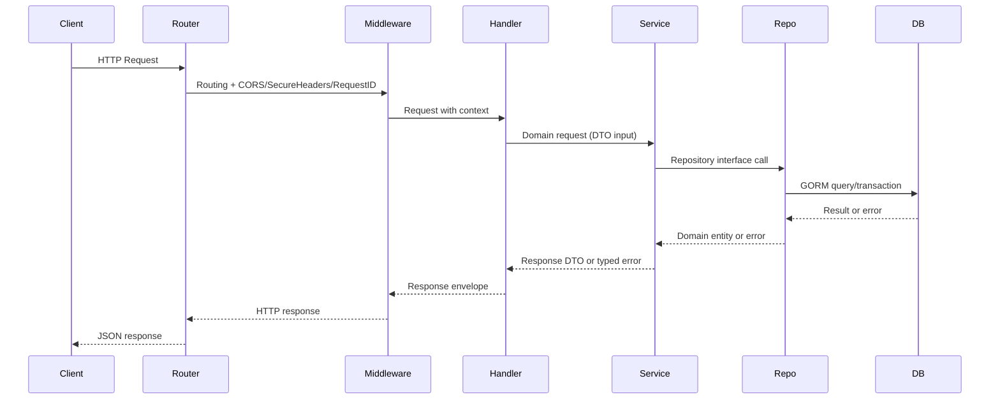
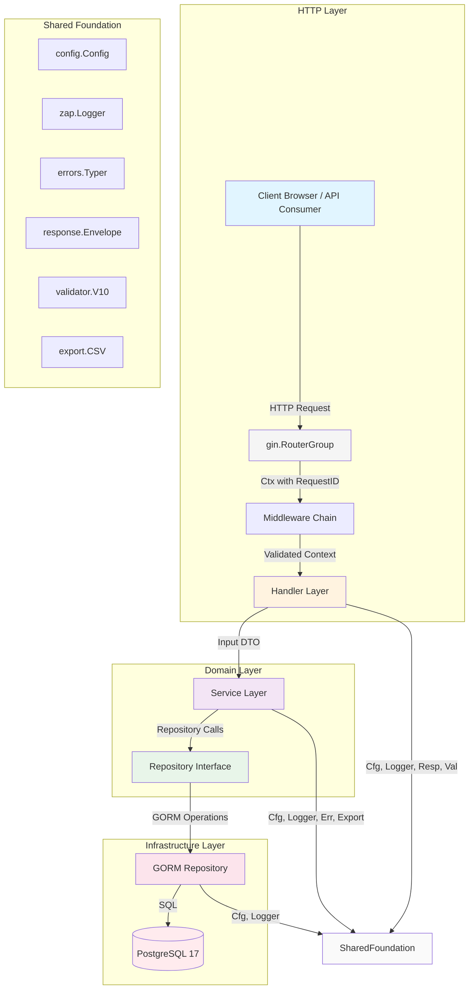
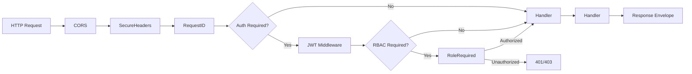

# Architecture Documentation

**Document Version:** 1.0  
**Phase:** 1 — Foundation  
**Date:** 2026-08-05

---

## 1. Clean Architecture Layering

The system follows Clean Architecture with a clear separation of concerns and dependency inversion.

### Layer Flow



### Layer Responsibilities

| Layer | Responsibility | Key Files |
|-------|---------------|-----------|
| **Handler** | HTTP request parsing, validation (validator/v10), response envelope formatting | `internal/*/handler.go` |
| **Service** | Business logic, domain validation, transaction orchestration, error wrapping | `internal/*/service.go` |
| **Repository Interface** | Abstract data access contract (no GORM dependency) | `internal/*/repository.go` |
| **Repository (GORM)** | Concrete database operations using GORM | `internal/*/repository.go` (concrete impl) |
| **Database** | PostgreSQL 17 with GORM AutoMigrate | `internal/shared/database/` |

### Dependency Injection Wiring

Dependencies flow **inward** (dependencies point toward abstractions):

```mermaid
graph TB
    subgraph cmd
        server[cmd/server/main.go]
    end

    subgraph shared
        config[internal/shared/config]
        logger[internal/shared/logger]
        db[internal/shared/database]
        resp[internal/shared/response]
        validator[internal/shared/validator]
        errors[internal/shared/errors]
        middleware[internal/shared/middleware]
        export[internal/shared/export]
        router[internal/shared/router]
    end

    subgraph modules
        auth[internal/auth]
        user[internal/user]
        product[internal/product]
        category[internal/category]
        inventory[internal/inventory]
        dashboard[internal/dashboard]
        report[internal/report]
        activitylog[internal/activitylog]
    end

    cmd -- config, logger, db, validator, errors, export, router --> server
    auth --> config, logger, db, validator, errors, export
    user --> config, logger, db, validator, errors
    product --> config, logger, db, validator, errors, export
    category --> config, logger, db, validator, errors, export
    inventory --> config, logger, db, validator, errors, export
    dashboard --> config, logger, db
    report --> config, logger, db, export
    activitylog --> config, logger, db, errors

    server --> auth, user, product, category, inventory, dashboard, report, activitylog
    server --> shared/middleware, shared/router
```

### Constructor Injection Pattern

Each module exposes a `New*` constructor that injects dependencies:

```go
// Example: auth module
func NewService(
    userRepo user.Repository,
    tokenManager TokenManager,
    logger *zap.Logger,
    cfg *config.Config,
) *Service {
    return &Service{
        userRepo:     userRepo,
        tokenManager: tokenManager,
        logger:       logger,
        cfg:          cfg,
    }
}
```

DI wiring happens in `cmd/server/main.go`:

```go
// cmd/server/main.go
func main() {
    cfg := config.Load()
    log := logger.New(cfg)
    db := database.Connect(cfg.Database)
    
    // Wire dependencies
    userRepo := repository.NewUserRepository(db)
    tokenManager := auth.NewTokenManager(cfg.JWT)
    
    authService := auth.NewService(
        userRepo,
        tokenManager,
        log,
        cfg,
    )
    
    authHandler := auth.NewHandler(authService, log)
    
    r := router.New()
    auth.RegisterRoutes(r.Group("/api/v1/auth"), authHandler)
    
    // ... rest of modules
}
```

---

## 2. Module Boundaries

Per PRD §9, the folder structure is:

```
cmd/
  server/          # Entry point, DI wiring, middleware registration
internal/
  auth/            # Authentication module
  user/            # User management module
  product/         # Product module
  category/        # Category module
  inventory/       # Inventory module
  dashboard/       # Dashboard module
  report/          # Reports module
  activitylog/     # Activity log module
  shared/          # Shared foundation packages
docs/              # Documentation
migrations/        # SQL migrations (if added later)
web/               # Frontend
tests/             # End-to-end tests
```

### `cmd/server` Responsibilities

- Application entry point (`main.go`)
- Configuration loading
- Logger initialization
- Database connection with AutoMigrate hook
- Middleware registration (CORS, SecureHeaders, RequestID, JWT, RBAC)
- Router setup and route registration
- Health check endpoint (`/healthz`)
- Graceful shutdown handling

### `internal/` Modules

Each module follows the same structure:

```
internal/
  auth/
    handler.go         # HTTP handlers
    service.go         # Business logic
    repository.go      # Repository interface + GORM impl
    model.go           # Domain models
    router.go          # Route registration
    token.go           # JWT/refresh token logic
    token_test.go      # Token tests
    handler_test.go    # Handler tests
```

### `internal/shared/` Packages

| Package | Responsibility | Key Files |
|---------|---------------|-----------|
| `config` | Viper configuration, environment loading | `config.go`, `config_test.go` |
| `logger` | Zap structured logging | `logger.go`, `logger_test.go` |
| `database` | GORM connection, AutoMigrate hook | `database.go`, `migrate.go`, `models.go` |
| `response` | Unified response envelope, pagination | `response.go`, `response_test.go` |
| `validator` | validator/v10 wrapper | `validator.go` |
| `errors` | Typed errors (NotFound, Validation, etc.) | `errors.go` |
| `middleware` | CORS, SecureHeaders, RequestID, JWT, RBAC | `cors.go`, `security.go`, `requestid.go`, `auth.go` |
| `export` | CSV export utility (RFC 4180) | `export.go`, `export_test.go` |

---

## 3. Module Responsibilities

| Module | Responsibility | Key Features |
|--------|---------------|--------------|
| **auth** | JWT access/refresh rotation, bcrypt passwords, RBAC | Register, login, logout, refresh, change-password, update-profile, RBAC middleware, per-IP rate limiting on public routes |
| **user** | Admin user management | List/search/paginate, get by ID, update profile, assign role, activate/deactivate, self-protection |
| **category** | Category CRUD | Full CRUD, search, sort, pagination, CSV export, conflict on delete if in use |
| **product** | Product CRUD with search/filter/sort | CRUD, search (name/SKU), category filter, price range, low-stock filter, is-archived filter, sort, pagination, CSV export, unique SKU enforcement |
| **warehouses** | Warehouse CRUD for multi-location stock | CRUD, search (name/code), is-active filter, soft-deactivate, conflict on delete if inventory references it; DEFAULT warehouse seeded for backward compatibility |
| **inventory** | Stock movements with atomic transactions | Stock-in, stock-out (DB transaction, per warehouse), warehouse-to-warehouse transfers (FOR UPDATE, two history rows sharing transfer_id), low-stock tracking, inventory list (joined with products, aggregate or per warehouse), transaction history, low-stock filter, CSV export |
| **dashboard** | Aggregates computed on demand | Total products, categories, inventory value, low-stock summary, recent activities, pending restock, warehouse health, top-selling products, inventory movement series, category distribution |
| **report** | Stock summary + CSV export | Stock summary report (per-category totals, low-stock list), CSV export via shared util |
| **activitylog** | Write on actions + filtered read | Logs auth events (login/register), mutation events (CRUD, stock-in/out, transfers), paginated/filtered read endpoint, never fails business operation on logging error |
| **shared** | Foundational packages | Config (Viper), logger (Zap), database (GORM), response envelope, validator (validator/v10), typed errors, middleware (+ rate limiting), export util |

---

## 4. Data Flow Diagram



---

## 5. Cross-Cutting Concerns

### Versioned migrations (golang-migrate)

Per the fix-v2-gaps reconciliation (F1), production schema management uses
**golang-migrate** with versioned SQL files in `migrations/` (applied via
`make migrate-up`). The migration CLI lives at `cmd/migrate` and reads the
same DB env vars as the server.

GORM AutoMigrate remains available for local development only, gated by
`DB_AUTOMIGRATE` (default `true`; set to `false` in production via
docker-compose). The server runs AutoMigrate only when the flag is true:

```go
// internal/shared/database/database.go
func AutoMigrate(db *gorm.DB, models ...interface{}) error {
    return db.AutoMigrate(models...)
}
```

Models are still registered in `internal/shared/database/models.go` — the
registry drives the dev AutoMigrate path and documents the schema that the
`migrations/` baseline mirrors.

### Response Envelope

All API responses follow the unified envelope:

```json
{
  "success": true,
  "message": "Operation completed",
  "data": { ... },
  "pagination": {
    "page": 1,
    "per_page": 20,
    "total": 100,
    "total_pages": 5
  }
}
```

### Typed Errors

All errors are typed and wrap context:

```go
// internal/shared/errors/errors.go
type ErrorType string

const (
    ErrNotFound       ErrorType = "not_found"
    ErrValidation     ErrorType = "validation"
    ErrUnauthorized   ErrorType = "unauthorized"
    ErrForbidden      ErrorType = "forbidden"
    ErrConflict       ErrorType = "conflict"
    ErrInternal       ErrorType = "internal"
)

type AppError struct {
    Type      ErrorType `json:"type"`
    Message   string    `json:"message"`
    Details   string    `json:"details,omitempty"`
    Err       error     `json:"-"`
}
```

Error wrapping with context:

```go
return nil, &errors.AppError{
    Type:    errors.ErrNotFound,
    Message: "product not found",
    Err:     fmt.Errorf("product repository GetByID(%s): %w", id, err),
}
```

### Zap Structured Logging

All logging uses structured fields:

```go
log.Info("login successful",
    zap.String("user_id", user.ID.String()),
    zap.String("email", user.Email),
    zap.String("ip", ip),
)
```

### Viper Configuration

Configuration is loaded once at startup:

```go
type Config struct {
    App       AppConfig       `mapstructure:"app"`
    Database  DatabaseConfig  `mapstructure:"database"`
    JWT       JWTConfig       `mapstructure:"jwt"`
    Bcrypt    BcryptConfig    `mapstructure:"bcrypt"`
    LowStock  LowStockConfig  `mapstructure:"low_stock"`
    CORS      CORSConfig      `mapstructure:"cors"`
}

func Load() *Config {
    v := viper.New()
    v.SetEnvPrefix("INVENTORY")
    v.AutomaticEnv()
    v.ReadInConfig()
    // ...
}
```

### Context Propagation

Context carries request-scoped values:

```go
// Middleware sets user_id and role in context
ctx = context.WithValue(ctx, "user_id", claims.UserID)
ctx = context.WithValue(ctx, "role", claims.Role)

// Handler reads from context
userID := ctx.Value("user_id").(uuid.UUID)
```

---

## 6. Module Dependency Matrix

| Module | Depends On | Notes |
|--------|-----------|-------|
| `auth` | shared/config, shared/logger, shared/database, shared/response, shared/validator, shared/errors, shared/export | No other modules |
| `user` | shared/config, shared/logger, shared/database, shared/response, shared/validator, shared/errors, auth (models only) | Reuses auth.User model |
| `product` | shared/config, shared/logger, shared/database, shared/response, shared/validator, shared/errors, shared/export, category | Category reference in DTO |
| `category` | shared/config, shared/logger, shared/database, shared/response, shared/validator, shared/errors, shared/export, product | Product check on delete |
| `inventory` | shared/config, shared/logger, shared/database, shared/response, shared/validator, shared/errors, shared/export, product | Product reference in transactions |
| `dashboard` | shared/config, shared/logger, shared/database | Read-only aggregates |
| `report` | shared/config, shared/logger, shared/database, shared/export | Uses shared CSV util |
| `activitylog` | shared/config, shared/logger, shared/database, shared/errors | Never fails business op on error |

---

## 7. Error Handling Flow

```mermaid
flowchart TD
    A[Handler receives request] --> B[Validate DTO]
    B -->|Invalid| C[Return 400 envelope]
    B -->|Valid| D[Service layer]
    
    D --> E{Business logic}
    E -->|Success| F[Return success envelope]
    E -->|NotFound| G[&ast;AppError{ErrNotFound}]
    E -->|Validation| H[&ast;AppError{ErrValidation}]
    E -->|Unauthorized| I[&ast;AppError{ErrUnauthorized}]
    E -->|Forbidden| J[&ast;AppError{ErrForbidden}]
    E -->|Conflict| K[&ast;AppError{ErrConflict}]
    E -->|Internal| L[&ast;AppError{ErrInternal}]
    
    G --> M[Log with zap.Error]
    H --> M
    I --> M
    J --> M
    K --> M
    L --> M
    
    M --> N[Return error envelope]
    
    style C fill:#ffebee
    style F fill:#e8f5e9
    style N fill:#ffebee
```

### Handler Error Unwrapping

```go
// internal/shared/response/response.go
func WriteError(w http.ResponseWriter, err error) {
    var appErr *AppError
    if errors.As(err, &appErr) {
        // Typed error handling
        w.WriteHeader(errorStatusCode[appErr.Type])
    } else {
        // Unexpected error
        w.WriteHeader(http.StatusInternalServerError)
    }
    json.NewEncoder(w).Encode(Envelope{
        Success: false,
        Message: err.Error(),
    })
}
```

---

## 8. Middleware Chain



### Middleware Order

1. **CORS** — Preflight handling, origin whitelist
2. **SecureHeaders** — X-Content-Type-Options, X-Frame-Options, CSP
3. **RequestID** — Generate/extract request ID, inject into context/logger
4. **JWT Auth** — Extract token, verify, set user_id/role in context
5. **RoleRequired** — Check required role (ADMIN/STAFF)
6. **Handler** — Business logic

---

## 9. Testing Strategy Alignment

| Layer | Test Type | Coverage Target |
|-------|-----------|-----------------|
| Handler | httptest + testify | 80%+ |
| Service | Mock repository | 80%+ |
| Repository | Dockerized PostgreSQL + testify | 80%+ |
| Middleware | httptest | 80%+ |
| Shared | Unit tests | 80%+ |

Test command per DoD:

```bash
go test -race -shuffle=on -count=1 -coverprofile=coverage.out ./...
go tool cover -func=coverage.out
```

Coverage gate: ≥80% per package.

---

*This document is SPEC-FIRST. All code implementations must conform to this architecture. Module names, layering, and responsibilities in later code todos must match this specification exactly.*
