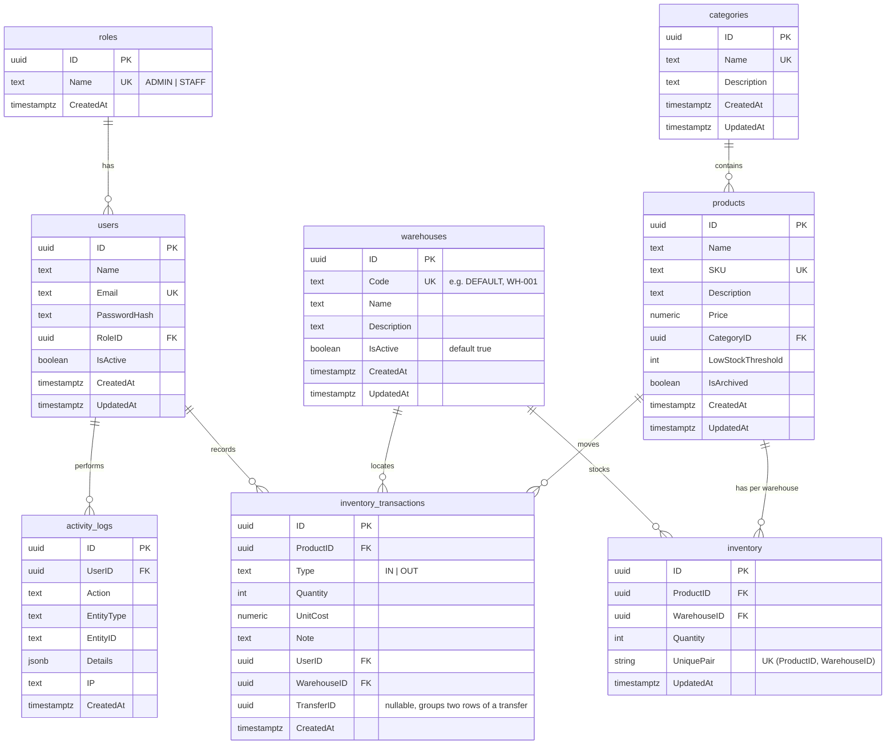

# Entity-Relationship Diagram

**Document Version:** 1.0
**Date:** 2026-08-06
**Status:** authoritative — matches `internal/*/model.go` GORM models.

## Mermaid

## Relationships (verbal)

- **roles → users**: one role (`ADMIN`/`STAFF`) has many users.
- **users → activity_logs**: a user performs audit events; `user_id` is nullable
  (system/seed events carry no user).
- **users → inventory_transactions**: nullable `user_id` records who performed
  a stock movement.
- **categories → products**: one category contains many products.
- **warehouses → inventory**: a warehouse holds per-product stock rows.
- **warehouses → inventory_transactions**: each movement is scoped to a warehouse.
- **products → inventory**: one row per (product, warehouse) pair — multiple
  locations tracked via the composite unique key.
- **products → inventory_transactions**: each movement (`IN`/`OUT`) references
  the product; quantity is always `> 0` (signed by `type`).
- **inventory_transactions transfer_id**: two rows sharing a non-null `transfer_id`
  encode a warehouse-to-warehouse transfer (OUT from source, IN to destination).

## Constraints

- `inventory_transactions.type` ∈ {`IN`, `OUT`}; `inventory.quantity >= 0`.
- `inventory` composite unique: `(product_id, warehouse_id)` — one stock row per location.
- Transfers use two `inventory_transactions` rows with the same `transfer_id` (one `OUT`, one `IN`).
- `products.low_stock_threshold >= 0` (default 10).
- `roles.name` ∈ {`ADMIN`, `STAFF`}.
- Unique: `users.email`, `products.sku`, `categories.name`, `inventory.product_id`.